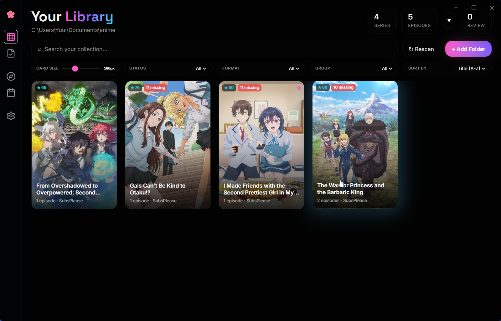
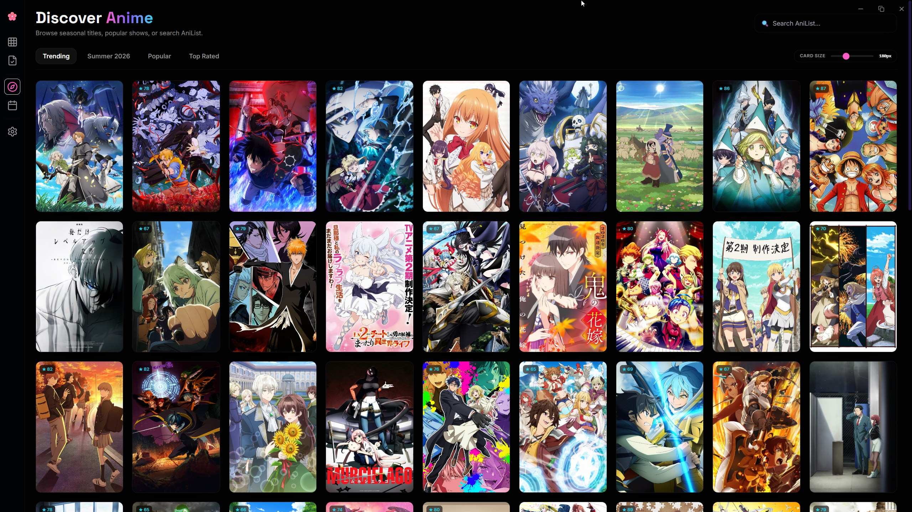
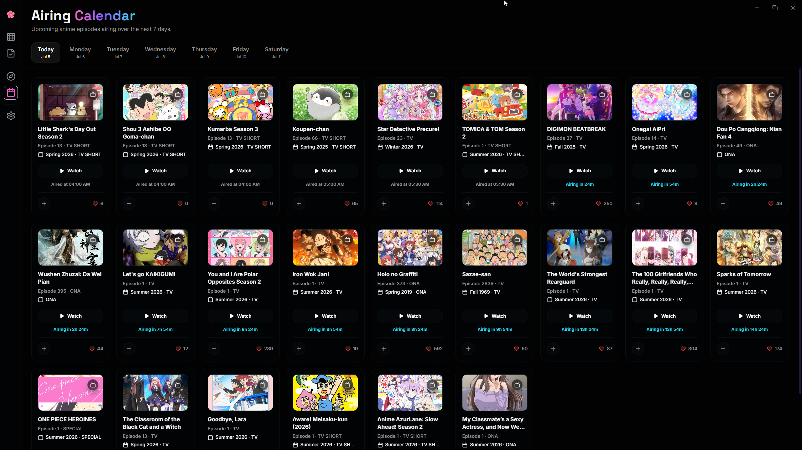

<div align="center">
  <h1>🌸 Yuui</h1>
  <p><strong>A premium desktop anime library manager for Windows</strong></p>
  <p>
    
    
    
    
  </p>
  <blockquote>⚠️ <strong>Currently in testing phase.</strong> Expect bugs and incomplete features.</blockquote>
</div>

---

## ✨ Features

- 📂 **Local Library Scanner** — Automatically scans your anime folder, groups episodes by series, and matches them to AniList metadata
- 🎌 **AniList Integration** — Sync your watch status, scores, progress, and favorites to your AniList account
- 🔍 **Discover Page** — Browse trending, seasonal, popular, and top-rated anime powered by AniList GraphQL
- 📅 **Airing Calendar** — See what episodes are airing this week, with live countdowns and trailer previews
- 🗂️ **Detail Pages** — Full anime info including characters, staff, relations, recommendations, and trailers
- 🏷️ **Genre & Tag Navigation** — Click any genre or tag to instantly search across all of AniList
- ✏️ **Manual Match Fixing** — Fix any incorrect automatic matches from the Review page
- ⚙️ **Settings** — AniList OAuth, TMDB backdrops, AniDB credentials, and library folder config

---

## 📸 Screenshots

### Your Library


### Discover Anime


### Airing Calendar


---

## 🚀 Tech Stack

| Layer | Technology |
|---|---|
| Desktop Shell | [Tauri v2](https://tauri.app/) (Rust) |
| Frontend | React 18 + TypeScript + Vite |
| Styling | Tailwind CSS + Glassmorphism |
| State | Zustand |
| Database | SQLite via SQLx |
| Metadata | [AniList GraphQL API](https://anilist.gitbook.io/anilist-apiv2-docs/) |
| HTTP Client | reqwest (Rust) |

---

## 🛠️ Building from Source

### Prerequisites
- [Node.js](https://nodejs.org/) 18+
- [Rust](https://rustup.rs/) (stable)
- Microsoft C++ Build Tools

### Development
```powershell
git clone https://github.com/Yuui03E/Yuui03e.git
cd Yuui03e
npm install
npm run tauri dev
```

### Production Build
```powershell
npm run tauri build
# Outputs to: src-tauri/target/release/bundle/
```

---

## ⚠️ Testing Phase Notice

This project is currently in **active testing**. The following features are still being worked on:

- TMDB backdrop integration
- AniDB file hashing & lookup
- Video preview generation (requires `ffmpeg` in PATH)
- Episode-level tracking UI
- Toast/notification system for sync feedback

Feedback and bug reports are welcome!

---

<div align="center">
  <sub>Made with 🌸 by Yuui</sub>
</div>
